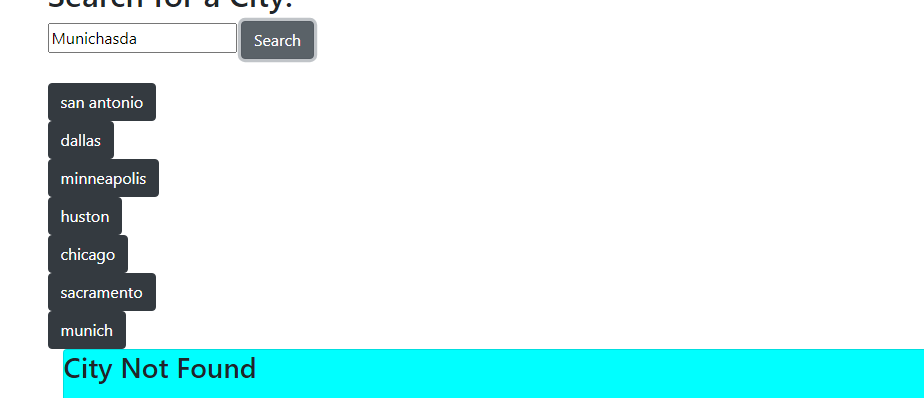
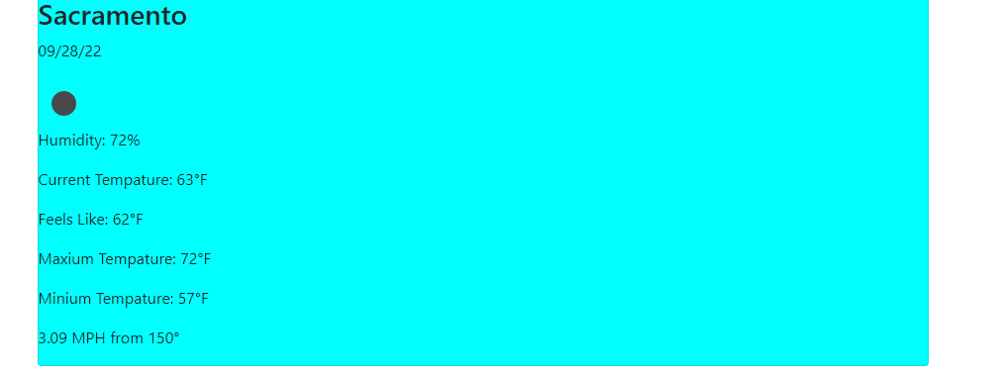
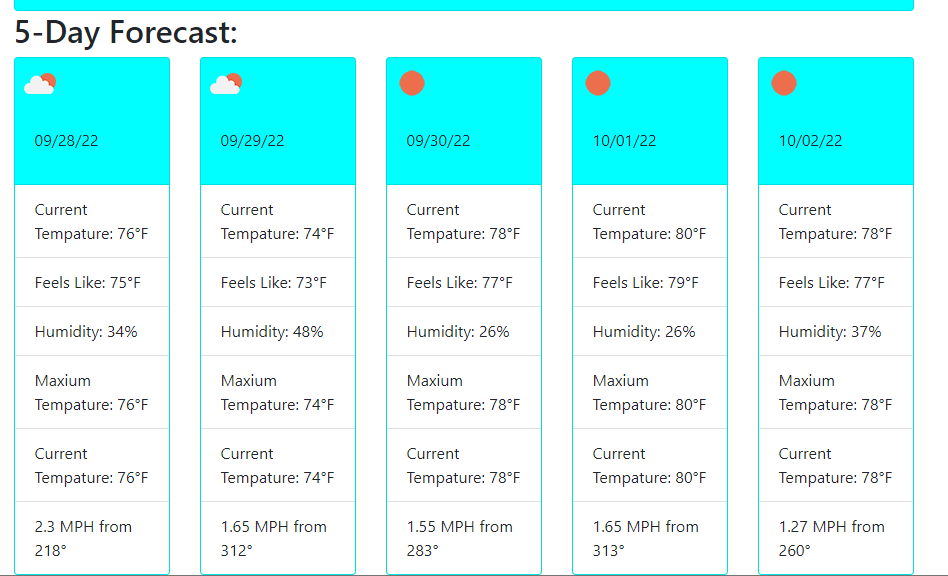
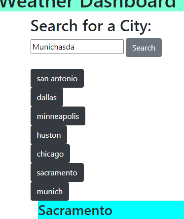
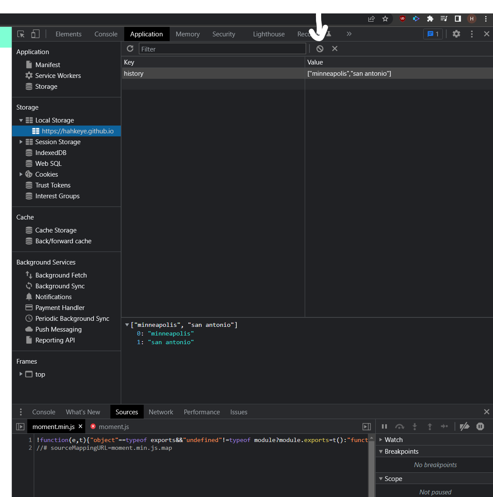

# Weather App

## Description

Simple web app to display the weather in a desired location. This is done by using the Open weather api and returning some json data and then displaying it.

## Table Of Cotents

- [Installation](#installation)
- [Usage](#Usage)
- [Git Pages](#pages)

## Installation
To get this up and runing simply download the repo. Extract and navigate your browser to the location of the index.html.

## Usage
To use this it is very simple. Simply type in a city and it will try to find it and display the weather. This works anywhere in the world. And if it cant find it it says it can not be found

If it can be found it will display the current weather for the day and a 5 day forecast.

The five day forecast is shown like this.

It has a history feature so you can easily go to past looked up citys. Simply click one of them.

if you would like to reset the history simply hit f12 and go to application. Then look on the left of that window for local storage and hit clear.

## Pages

If you would like to view this live. Github has this great utility called Gitpages where you can host stuff.
If you click [here](https://hahkeye.github.io/weather-checker/)